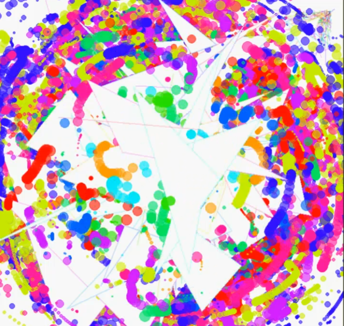

> # randomviz

Support for completely useless pursuit of random animations

## Goals
There is no point except to make random point, line and polygon animations. If you want to make generative art, you probably should look at other options as this package is usless, except for randomviz.

## Inspiration
Earlier excercise in randomviz.

#### [Repulsive points and aimlessly spinning polygons](https://www.flickr.com/photos/dgrapov_2/6215428437/in/photostream/)

#### [`plot` overload](https://www.flickr.com/photos/dgrapov_2/7046918685/)

## Current state of useless capabilities

* generate random points (`parts`) assigned to random groups
* linear attractor or repulsor of parts
* wonky rotation of parts
* plot parts as points, lines and polygons
* create animations of plots

## Examples

#### Parts 

#### Lines

#### Polygons

#### Rotated polygons

## Useless improvements
 * replace base::lapply with parallel purrr::map
 * replace base::plot with ggplot2:ggplot
